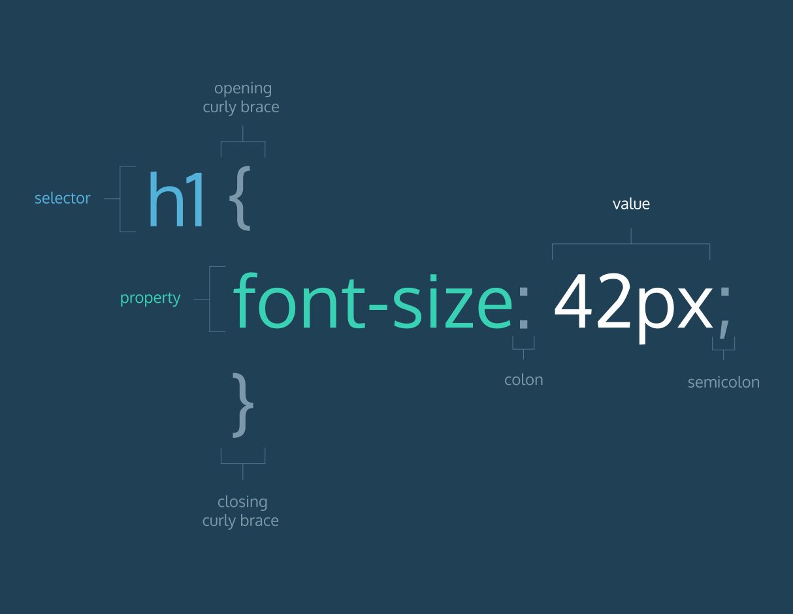
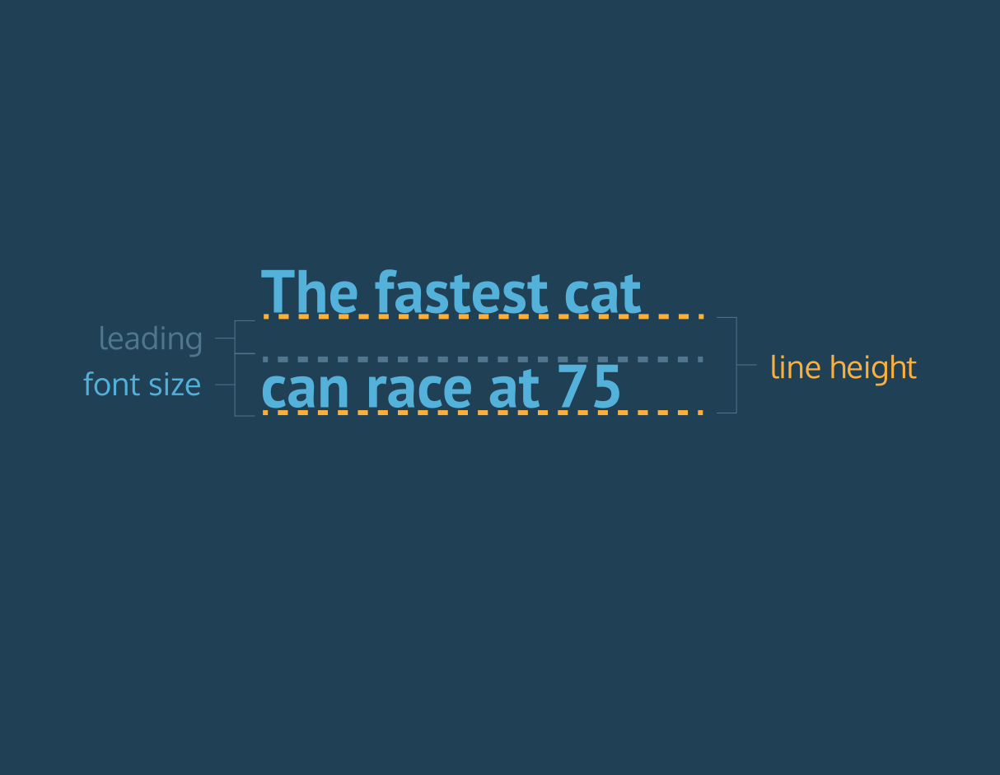

# Notes of HTML&CSS Course in CodeCademy

## 1. Structure

1. `<!DOCTYPE html>` should always be the first line of code.
2. Code structure: `<html><head><title></title></head><body></body></html>`

## 2. Common HTML Elements

1. Heading: `<h1>` to `<h6>`
2. Paragraph: `<p>`
3. Unordered list: `<ul><li></li><li></li></ul>`
4. Ordered list: `<ol><li></li><li></li></ol>`
5. Link: `<a href="uri">link name</a>`. You can turn anything into a link by wrapping it with an `<a>` element.
6. Image: ``
7. Comment: `<!-- This is a comment -->`

## 3. CSS Basic

1. Write CSS code in HTML with `<style>` element
2. Using `<link>` element to link a CSS sstylesheet to an HTML file. Three attributes are needed:
3. * `href` - set equal to the path of the CSS file
   * `type` - set equal to `text/css`
   * `rel` - set equal to `stylesheet`


3. CSS declaration

   


4. CSS declarations must end in a semicolon

5. Multiple element selectors can be used to style multiple elements at once: 

   ```css
   h1, h2, p {
     color: Green;
   }
   ```

6. Comments: `/*comment*/`

7. CSS spacing and indentation best practice:

   * One space between a selector and the opening curly brace.
   * No extra spacing between CSS declarations and the opening and closing curly braces of the CSS rule.
   * Two spaces of indentation.
   * One line of spacing between CSS rules.


## 4. CSS Color

1. foreground color `color` and background color `background-color`
2. Naming a color:
   * Color name: `color: Crimson;` [147 color name](http://www.colors.commutercreative.com/grid/)
   * RGB: `color: rgb(123, 20, 233);` (integer between 0 and 255 for every dimension)
   * RGB with hex number: `color: #09AA34;`
   * HSL: `color: hsl(182, 20%, 50%);` HSL stands for Hue, Saturation and Lightness:
     * Hue - describing color. Hue is represented on a color wheel and has values between 0 and 360
     * Saturation - the amount of gray in color. Using a percentage between 0% and 100%. 0% represents a shade of gray, whereas 100% represents full saturation.
     * Lightness - the amount of white in color. 0% to 100%. 0% represents black, whereas 100% represents white. 50% is normal.
   * RGBA: `color: rgba(123, 88, 9, 0.5);` `a` means the alpha value, representing the opacity of a color.


## 5. CSS Font

1. Font style(typeface): `font-family: Garamond, Times, serif;`

   * Serif fonts: Have extra details on the ends of strokes in a letter or symbol
   * Sans-Serif fonts
   * `Times` and `serif` in the above code are fallback fonts which will be used when the front font is not installed on a user's computer

2. Use Google fonts in an HTML:

   ```html
   <html>
     <head>
       <link href="https://fonts.googleapis.com/css?family=Roboto:100" type="text/css" rel="stylesheet" >
     </head>
   </html>
   ```

3. Font size can be specified using pixels, ems or percentages

   * `em` - `font-size: 1.3em;` An em is equal to the width of the letter "m"
   * `%` - Another relative unit. The default size of text in web browsers is 16 pixels, or `16px`.

4. Line height: `line-height: 1.5em;`

   * Line height and the font size:

     

5. Word space: `letter-spacing: 0.3em;` The horizontal spacing between words.

6. Line space: `letter-spacing: 0.3em;` The spacing between letters, the kernel.

7. Text properties:

   * `fond-weight`: `bold` or `normal`

   * Font weights can be set to `100` (thin), `200`, `300`, `400` (normal weight), `500`, `600`, `700`, `800`, or `900` (bold).

   * Set font weights in *style.css*:

     ```css
      font-weight: 100;
     ```

   * Set font weights in HTML:

     ```HTML
     <link href="https://fonts.googleapis.com/css?family=Roboto:100" rel="stylesheet">
     ```

   * `font-style`: `italics` or `normal` 

   * Transforming text to uppercases or lowercase: `text-transform: uppercases;`; `lowercases`

8. Text alignment: `text-align: right;`

   * `left` 
   * `center`
   * `right`


## 6. Organizing - Classes, IDs and DIVs

1. IDs should be **unique**.

2. Classes label elements will share the same styling, which makes styling more efficient.

3. `<div>` groups elements together. DIVs are one of the most commonly used HTML elements.

4. HTML elements can be labeled with multiple classes:

   ```html
   <h1 class="book domestic">The Way of the Deep</h1>

   <h1 class="book foreign">A Night in the Sky</h1>
   ```


## 7. CSS Box Model

### 7.1 Box

* `weight` and `height`

* Minimum and maximum weight and height

* `overflow` : `hidden` or `scroll`

  ```css
  p {
    min-width: 300px;
    max-width: 600px;
    min-height: 150px;
    max-height: 300px;
    overflow: scroll; 
  }
  ```


### 7.2 Border

* `border-width`

  1. `thin`

  2. `meduim`

  3. `thick`

  4. pixels, ems, percentages

  5. For each side: `border-width: 3px 1px 2px 1px;` or (`border-top-width`, 

     `border-right-width`, `border-bottom-width`, `border-left-width`)

     ​

* `border-style`

  1. `solid` - border is a solid line.
  2. `dashed` - border is a series of lines or dashes.
  3. `dotted` - border is a series of square dots.
  4. `double` - border is two solid black lines.
  5. `groove` - border is a groove (or carving).
  6. `inset` - border appears to cut into the screen.
  7. `outset` - border appears to pop out of the screen.
  8. `ridge` - border appears as a picture frame.
  9. `hidden` or `none` - no border.

  ​

* `border-color`

* Set all properties in `border`

* Change box shape: `border-raduis`

  ```css
  div.container {
    height: 60px;
    width: 60px;
    border: 3px solid rgb(22, 77, 100);
    border-radius: 100%;
  }
  ```

  ​

### 7.3 Spacing in the Box

1. Paddings

   * `padding: 5px 10px 5px 10px;`
   * `padding: 5px 10px;`  (first for top and bottom)
   * `padding-top`, `padding-right`, `padding-bottom`, `padding-left`

2. Margins

   * Almost the same as paddings
   * Auto: `margin: auto;` When `margin: auto` is used, an element will center *relative* to its container.

3. Reset defaults

   ```css
   * {
     margin: 0;
     padding: 0;
   }
   ```

4. Display

   * `display: inline`
   * `block`
   * `inline-block`: causes block-level elements to behave like an inline element, but retain the features of a block-level element.
   * `none`: removes an element from view. The element with this property will not be shown and its space will not be reserved.

5. Visibility

   * `visibility: hidden`: hides an element
   * `visible`: displays an element
   * **Note:** What's the difference between `display: none` and `visibility: hidden`? An element with `display: none` will be completely removed from the web page. An element with `visibility: hidden`, however, will not be visible on the web page, but **the space reserved** for it will.


### 7.4 Content-Box Illustration


### 7.5 Border-Box

* Using border-box box model

  ```cSS
  * {
    box-sizing: border-box;
  }

  h1 {
    border: 1px solid black;
    height: 200px;
    width: 300px;
    padding: 10px;
  }
  ```

* Border-box model illustration

* 


## 8. Layout

1. `position`

   * Four offset properties:
     1. `top` - moves the element down.
     2. `bottom` - moves the element up.
     3. `left` - moves the element right.
     4. `right` - moves the element left.


   * `static` : default value

   * `relative`

   * 1. Position an element *relative* to its default static position on the web page. Using the following four offset properties:
     2. Note that offset properties will not work if the position of the element is not set to `relative`.

     `absolute`


   * 1. All other elements on the page will *ignore* the element and act like it is not present on the page.
     2. If offset properties weren't specified, the box would be entirely covered by the bottom box.
   * `fixed`: *fix* an element to a specific position on the page (regardless of user scrolling).

2. `z-index`: controls the vertical stacking order of an element. An element with greater stack order is always in front of an element with a lower stack order. 

3. `float`: moving an element as far left or as far right as possible

   * `left`
   * `right`

4. `clear`: specifies how elements should behave when they dump into each other

   * `left` - no floating elements allowed on the **left** side of the element
   * `right`
   * `both`
   * `none`


## 9. Image

1. Img properties:

   * `width`

   * `height`

   * Centering images: By default, images are inline elements. For images to center properly, they must behave as block-level elements.

     ```css
     img.leaf {
       width: 300px;
       height: 200px; 
       display: block;
       margin: 0px auto;
     }
     ```

2. Background images

   * `background-image: url('#')`

   * `background-repeat`:

     1. `repeat` - the default value, the image will repeat horizontally and vertically.
     2. `repeat-x` - the background image will be repeated only along the x-axis (horizontally).
     3. `repeat-y` - the background image will be repeated only along the y-axis (vertically).
     4. `no-repeat` - the background image will not be repeated at all and will appear only once.

   * `background-position`:

     1. `left top` - top left corner of the element's box.
     2. `center top` - top center of the element's box.
     3. `right top` - top right corner of the element's box.
     4. `left center` - left column, center row.
     5. `center center` - the center of the element's box.
     6. `right center` - right column, center row.
     7. `left bottom` - bottom left corner of the element's box.
     8. `center bottom` - bottom center of the element's box.
     9. `right bottom` - bottom right corner of the element's box.
     10. Note that the values are in pairs. When setting this property, if only one value is specified, the second value will default to `center`.

   * Put three properties together:

     ```css
     p {
       background: url("#") no-repeat right center;
     }
     ```

   * `background-size` : 

     * `cover`  - the image will be expanded and distorted
     * `contain` - the image will be expanded as large as possible but the image will be letterboxed(undistorted, i.e., preserving the image's original aspect ratio)

   * `background-attachment`

     * `scroll` - allows the image to move up and down as a user scrolls
     * `fixed` - pins the image on the page

   * Set the color gradient of background image

     ```css
     div.header {
       height: 400px;
       width: 400px;
       background-image: -webkit-linear-gradient(#666CCC, #BC1324);
     }
     ```

3. What to use, foregound(``) or background image (`backgound-image`)

   * When an image communicates important information to a user, you can use the `` element and style the image using CSS, if needed.
   * When an image is intended to style a web page, you can use the `background` property and further style it with CSS.


##  10. Table

1. HTML elements

   ```html
   <table>
     <thead>
       <tr>
         <th>Title 1</th>
         <th>Title 2</th>
       </tr>
     </thead>
     
     <tbody>
       <tr>
         <td colspan="2"></td>
         <td>...</td>
       </tr>
       <tr>
         <td rowspan="2"></td>
       </tr>
     </tbody>
     
     <tfoot>
     	<tr>
         <td>...</td>
       </tr>
     </tfoot>
   </table>
   ```

2. `rowspan`: makes table data(`td`) to span rows

3. `colspan`: makes table data(`td`) to span columns

